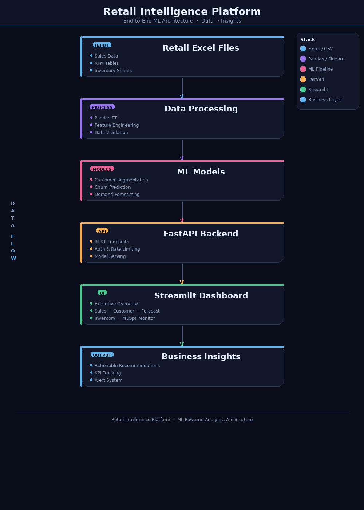

# 🛒 NeuralRetail – AI Sales Intelligence Platform

<div align="center">



**Amdox Technologies | AMX-DS-2026-04 | April 2026**

*Prepared by: **Ayush Tiwari** | Data Science & Analytics*

[](https://python.org)
[](https://fastapi.tiangolo.com)
[](https://streamlit.io)
[](https://xgboost.readthedocs.io)
[](https://lightgbm.readthedocs.io)
[](https://facebook.github.io/prophet/)
[](LICENSE)

</div>

---

## 📌 Project Overview

**NeuralRetail** is an end-to-end AI-powered retail analytics platform that transforms raw transaction data into actionable business intelligence. It combines machine learning, demand forecasting, and inventory optimization into a unified dashboard and REST API.

| Component | Technology | Purpose |
|---|---|---|
| 🧹 Data Pipeline | Pandas, NumPy | Cleaning, feature engineering |
| 🤖 ML Models | XGBoost, LightGBM, KMeans, Prophet | Churn, segmentation, forecasting |
| 📦 Inventory Engine | EOQ + ABC-XYZ | Inventory optimization |
| 🌐 REST API | FastAPI + Uvicorn | Production scoring layer |
| 📊 Dashboard | Streamlit + Plotly | Business intelligence UI |

---

## 🎯 Business Problem

Retail businesses face critical challenges:
- **High churn rates** — customers leaving without warning signals
- **Poor inventory management** — stockouts or overstock eating into margins
- **No demand visibility** — inability to forecast future sales by SKU
- **Disconnected data** — no unified view of customer value and behavior

**NeuralRetail solves all four** with a single integrated platform.

---

## 📂 Repository Structure

```
NeuralRetail-AI-Sales-Intelligence/
│
├── README.md                          ← You are here
├── requirements.txt                   ← All Python dependencies
├── .gitignore                         ← Files excluded from Git
├── LICENSE                            ← MIT License
│
├── app/
│   ├── neuralretail_dashboard.py      ← Streamlit dashboard (4 pages)
│   └── fastapi_app.py                 ← FastAPI REST API (8 endpoints)
│
├── data/
│   ├── online_retail_CLEANED.xlsx     ← Cleaned transaction data
│   ├── rfm_segments_churn.xlsx        ← Customer RFM + churn scores
│   ├── inventory_eoq.xlsx             ← EOQ + ABC-XYZ inventory data
│   └── demand_forecast.xlsx           ← Prophet demand forecasts
│
├── notebooks/
│   ├── neuralretail1.ipynb            ← Data Cleaning & EDA
│   ├── neuralretail_models_.ipynb     ← Feature Engineering & ML Models
│   ├── neuralretail_dashboard.ipynb   ← Dashboard development
│   └── neuralretail_fastapi.ipynb     ← FastAPI development & testing
│
├── screenshots/
│   ├── executive_overview.png
│   ├── sales_dashboard.png
│   ├── customer_dashboard.png
│   ├── forecast_dashboard.png
│   ├── inventory_dashboard.png
│   ├── mlops_monitor.png
│   └── swagger_api.png
│
├── docs/
│   ├── architecture.png               ← System architecture diagram
│   ├── project_report.pdf             ← Full project report
│   └── deployment_guide.md            ← Step-by-step deployment guide
│
└── models/
    ├── churn_model.pkl                ← Trained XGBoost churn model
    ├── segment_model.pkl              ← KMeans segmentation model
    └── forecast_model.pkl             ← Prophet forecast model
```

---

## 📊 Dataset

| Property | Value |
|---|---|
| **Source** | UCI Online Retail Dataset (UK E-commerce) |
| **Raw Records** | ~500,000 transactions |
| **After Cleaning** | ~380,000+ records |
| **Customers** | 4,300+ unique customers |
| **SKUs** | 3,600+ unique products |
| **Date Range** | Dec 2009 – Dec 2011 |
| **Currency** | GBP → converted to INR (×107) |

### Raw Columns
`InvoiceNo`, `StockCode`, `Description`, `Quantity`, `InvoiceDate`, `UnitPrice`, `CustomerID`, `Country`

### Engineered Features Added
`Revenue`, `Year`, `Month`, `DayOfWeek`, `IsWeekend`, `WeekOfYear`, `Quarter`, `Hour`, `AvgTempC`, `RainfallMM`, `IsRainy`, `CompetitorPrice`, `PriceDiff_Pct`, `Age`, `AgeGroup`, `Region`, `Gender`, `LoyaltyTier`

---

## 🧹 Data Cleaning (Notebook 1)

**Steps performed:**

1. **Column rename** — `Price → UnitPrice`, `Customer ID → CustomerID`, `Invoice → InvoiceNo`
2. **Missing values**
   - `CustomerID` → rows dropped (required for customer analysis)
   - `Description` → filled with `"Unknown"`
   - `UnitPrice`, `Quantity` → filled with column median
3. **Duplicate removal** — `drop_duplicates()`
4. **Data type fixes** — `InvoiceDate` to datetime, `CustomerID` to int
5. **Invalid transactions** — removed rows where `Quantity ≤ 0` or `UnitPrice ≤ 0`
6. **Cancelled orders** — removed invoices starting with `"C"`
7. **Outlier removal** — IQR method on `Quantity` and `UnitPrice`

**Output:** `online_retail_CLEANED.xlsx`

---

## 🔬 Exploratory Data Analysis

Charts produced during EDA:

| # | Chart | Insight |
|---|---|---|
| 1 | Missing Values Bar Chart | CustomerID (25%) and Description (0.3%) had nulls |
| 2 | Quantity Distribution (Before/After) | Heavy right skew; outliers removed via IQR |
| 3 | UnitPrice Distribution | Long tail; capped with IQR |
| 4 | IQR Outlier Boundaries | Visual confirmation of bounds |
| 5 | Correlation Heatmap | Revenue highly correlated with Quantity |
| 6 | Monthly Revenue Trend | Strong seasonality peaking in Nov |
| 7 | Top 10 Products by Revenue | PAPER CRAFT items dominate |
| 8 | Revenue by Country | UK accounts for ~85% of revenue |
| 9 | RFM Distributions | Right-skewed Recency; Frequency peaks at 1–5 |

---

## 👥 Customer Segmentation

### RFM Analysis
Computed **Recency**, **Frequency**, and **Monetary** for each customer with a snapshot date of `max(InvoiceDate) + 1 day`.

Each dimension scored 1–5 using quantile-based scoring:
- `R_Score` — lower recency = higher score
- `F_Score` — higher frequency = higher score
- `M_Score` — higher monetary = higher score
- `RFM_Score` = R + F + M (range: 3–15)

### KMeans Clustering
- **Silhouette analysis** run for k = 2 to 8
- Optimal **k = 4** selected
- Features: `Recency`, `Frequency`, `Monetary` (StandardScaler normalized)
- Clusters labeled: **Champions**, **Loyal Customers**, **At Risk**, **Lost**

### Gaussian Mixture Models (GMM)
- Alternative probabilistic clustering
- Soft assignments with cluster probabilities

### DBSCAN
- Density-based outlier detection
- Identifies anomalous customers

### Segment Summary

| Segment | Description | Action |
|---|---|---|
| 🏆 Champions | High RFM, low churn risk | Reward & upsell |
| 💛 Loyal | Frequent buyers | Loyalty program |
| ⚠️ At Risk | High recency, declining | Win-back campaign |
| ❌ Lost | No recent activity | Re-engagement or drop |

---

## 🔮 Churn Prediction

### Target Variable
`Churned = 1` if `Recency > 90 days` (no purchase in 3 months)

### Models Trained

| Model | Description |
|---|---|
| Logistic Regression | Baseline linear model |
| XGBoost | Gradient boosting (primary model) |
| LightGBM | Fast gradient boosting (ensemble) |

### Final Approach
**Ensemble** of XGBoost + LightGBM with averaged probabilities for `ChurnProba`.

### Performance
Evaluated on train/test split (80/20) with:
- `ROC-AUC Score`
- `Classification Report` (Precision, Recall, F1)
- `Confusion Matrix`

### Output Columns in `rfm_segments_churn.xlsx`
`CustomerID`, `Recency`, `Frequency`, `Monetary`, `RFM_Score`, `CLV_Estimate`, `Segment`, `ChurnProba`, `ChurnRisk` (Low / Medium / High), `IsVIP`, `KMeansCluster`

---

## 📈 Demand Forecasting

### Approach
**Facebook Prophet** — additive time-series forecasting with:
- Yearly seasonality
- Weekly seasonality
- Holiday effects
- Automatic trend detection

### Process
1. Aggregate daily quantity per `StockCode`
2. Filter SKUs with ≥ 30 days of data
3. Fit Prophet model per SKU
4. Forecast **30 days ahead**
5. Cap negative forecasts at 0

### Output Columns in `demand_forecast.xlsx`
`StockCode`, `ds` (date), `yhat` (forecast), `yhat_lower`, `yhat_upper`

---

## 📦 Inventory Optimization

### EOQ (Economic Order Quantity)
```
EOQ = √(2 × D × S / H)
```
Where: `D` = annual demand, `S` = ordering cost (£50), `H` = holding cost (20% of price)

### Safety Stock
```
SafetyStock = Z × σ_demand × √LeadTime
```
Z = 1.645 (95% service level), LeadTime = 7 days

### Reorder Point
```
ReorderPoint = (AvgDailyQty × LeadTime) + SafetyStock
```

### ABC-XYZ Classification
- **ABC** — by revenue (A = top 80%, B = next 15%, C = remaining 5%)
- **XYZ** — by demand variability (X = low CV, Y = medium, Z = high)

### Output Columns in `inventory_eoq.xlsx`
`StockCode`, `EOQ`, `SafetyStock`, `ReorderPoint`, `AvgDailyQty`, `ABC_Class`, `XYZ_Class`, `AnnualDemand`, `UnitCost`

---

## 🌐 FastAPI Endpoints

Base URL: `http://localhost:8000`

| # | Endpoint | Method | Description |
|---|---|---|---|
| 1 | `/health` | GET | API health check + data file status |
| 2 | `/summary` | GET | Full KPI snapshot (revenue, churn rate, etc.) |
| 3 | `/predict/churn` | POST | Churn probability for 1 customer |
| 4 | `/predict/demand` | POST | Demand forecast for 1 SKU |
| 5 | `/segment/score` | POST | RFM segment for 1 customer |
| 6 | `/inventory/reorder` | POST | EOQ & reorder advice for 1 SKU |
| 7 | `/predict/churn/high-risk` | GET | Top-N high-risk customers (batch) |
| 8 | `/inventory/alerts` | GET | All SKUs needing reorder (batch) |

### Example Request
```bash
curl -X POST "http://localhost:8000/predict/churn" \
     -H "Content-Type: application/json" \
     -d '{"customer_id": "12345"}'
```

### Example Response
```json
{
  "customer_id": "12345",
  "churn_proba": 0.73,
  "churn_risk": "High",
  "segment": "At Risk",
  "recency_days": 95,
  "frequency": 3,
  "monetary": 245.50,
  "recommendation": "Launch win-back campaign immediately"
}
```

Interactive API docs: `http://localhost:8000/docs`

---

## 📊 Dashboard Pages

### Page 1 — 📊 Sales Dashboard
- Total Revenue, Orders, Customers, Avg Order Value KPIs
- Monthly Revenue Trend (line chart)
- Revenue by Country (choropleth map)
- Top 10 Products by Revenue
- Revenue by Day of Week heatmap
- Weather impact analysis

### Page 2 — 👥 Customer Dashboard
- Churn Rate, VIP Customers, Avg CLV KPIs
- RFM Segment distribution (pie chart)
- Churn Risk breakdown
- Customer CLV distribution
- Segment performance comparison
- Demographics breakdown (Age, Gender, Region)

### Page 3 — 📈 Forecast Dashboard
- SKU selector
- 30-day demand forecast with confidence intervals
- Historical vs forecasted comparison
- Forecast accuracy metrics

### Page 4 — 📦 Inventory Dashboard
- SKUs needing reorder alerts
- ABC-XYZ classification matrix
- EOQ recommendations table
- Safety stock vs current stock comparison

---

## 🚀 Running Locally

### Prerequisites
- Python 3.10+
- pip

### 1. Clone the repository
```bash
git clone https://github.com/yourusername/NeuralRetail-AI-Sales-Intelligence.git
cd NeuralRetail-AI-Sales-Intelligence
```

### 2. Install dependencies
```bash
pip install -r requirements.txt
```

### 3. Run notebooks in order
```
notebooks/neuralretail1.ipynb          → generates online_retail_CLEANED.xlsx
notebooks/neuralretail_models_.ipynb   → generates rfm_segments_churn.xlsx,
                                          inventory_eoq.xlsx, demand_forecast.xlsx
```

### 4. Start FastAPI
```bash
cd app
uvicorn fastapi_app:app --reload --port 8000
```

### 5. Start Streamlit Dashboard
```bash
cd app
streamlit run neuralretail_dashboard.py
```

---

## ☁️ Deployment

### FastAPI on Render / Railway
**Start command:**
```bash
uvicorn fastapi_app:app --host 0.0.0.0 --port 10000
```

**Root file:** `app/fastapi_app.py`

### Streamlit on Streamlit Cloud
1. Push to GitHub
2. Go to [share.streamlit.io](https://share.streamlit.io)
3. Select repo → set main file to `app/neuralretail_dashboard.py`
4. Deploy ✅

---

## 🔭 Future Scope

| Feature | Description |
|---|---|
| 🔄 Real-time pipeline | Kafka + streaming ingestion |
| 🧠 Deep learning | LSTM for time-series forecasting |
| 💬 NLP reviews | Sentiment analysis on product reviews |
| 📱 Mobile app | React Native dashboard |
| 🔗 CRM integration | Salesforce / HubSpot connector via API |
| 🌍 Multi-region | Multi-country deployment on AWS |
| 📧 Alert system | Email/SMS churn alerts via Twilio |

---

## 👤 Author

**Ayush Tiwari**
Data Science & Analytics
Amdox Technologies | AMX-DS-2026-04
April 2026

---

## 📄 License

This project is licensed under the MIT License — see [LICENSE](LICENSE) for details.
